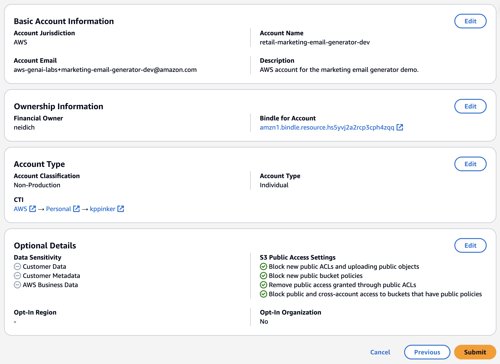
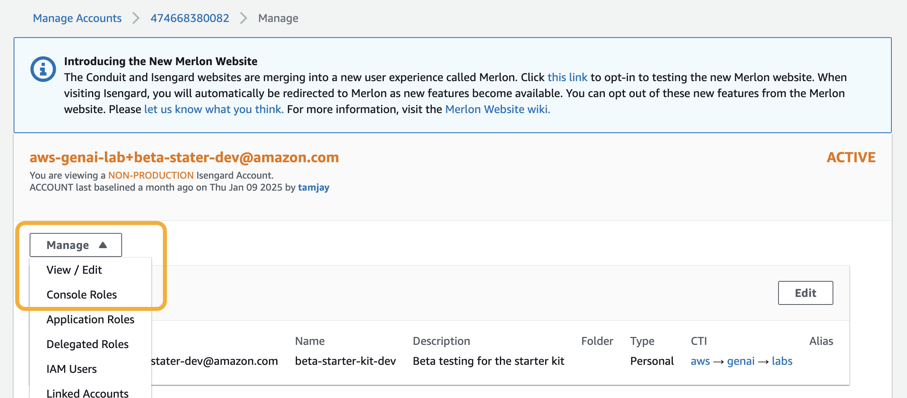
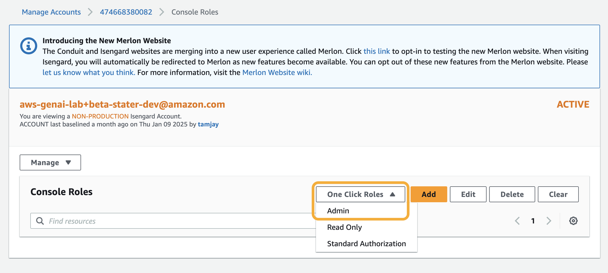
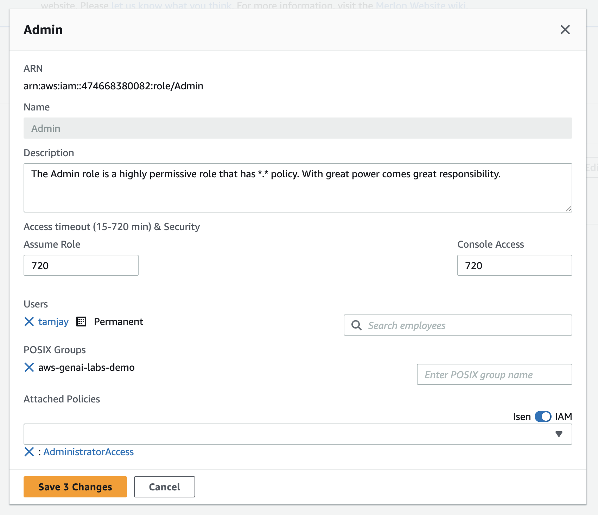

# Isengard Account Creation

If you are creating a brand new demo, create new dev/prod accounts using the instructions below. If your demo has already been created, skip to [Sandbox Account Creation](#sandbox-account).

[TOC]

## Dev Account

1. Navigate to [Merlon](https://iad.merlon.amazon.dev/create-account/aws).
2. Under **Business Accountability**, ensure the **AWS (Isengard)** option is selected.
3. Enter an **Account Name** using the following format `[SEGMENT]-[DEMO-NAME]-[STAGE]`.
    - Ex: `retail-marketing-email-generator-dev`
4. Enter an **Account Email** using the following format `aws-genai-labs+[DEMO-NAME]-[STAGE]@amazon.com`\*.
    - Ex: `aws-genai-labs+marketing-email-generator-dev@amazon.com`
    * Adding a `+` qualifier to the GenAI Labs group email will create a unique email address for each new demo.
5. Enter a short **Account Description** for your demo then click **Next**.
6. Under **Bindle For Account**, search for then select `AWS-GenAI-Labs-Demo` (this should refer to the bindle ID `amzn1.bindle.resource.hs5yvj2a2rcp3cph4zqq`)\*.
    > [Why can't I find the GenAI Labs Bindle?](./faq.md#why-cant-i-find-the-genai-labs-bindle)
7. Click **Next**. Leave the **Account Classification** as **Non-Production** and **Account Type** as **Individual**.
8. Under **Owning CTI**, select your personal CTI properties.
    - You will need to [create a personal CTI](./bindle-creation.md#cti-and-resolver-group) if you do not have one already.
9. Click **Next**. On the **Optional Details** page, leave all the boxes unchecked then click **Next** again.
10. Verify the final **Review and Submit** page then click **Submit**.

    

    - Account creation may take a few minutes.

11. Once your account is created, navigate to the [Isengard manage accounts dashboard](https://isengard.amazon.com/manage-accounts) then search for and click on the account.
12. Click the **Manage** dropdown then select **Console Roles**.

    

13. Click the **One Click Roles** dropdown then select **Admin**.

    

14. Select the **Admin** role card you just created then click **Edit**.
15. Enter the folowing parameters:

    **Assume Role**: `720`

    **Console Access**: `720`

    **POSIX Groups**: `aws-genai-labs-demo`

16. Optionally, You add non-GenAI Labs team members to this role by entering their alias in **Search employees**.

    

17. Click **Save X Changes**.

18. Optionally, create a **Read Only** role from the **One Click Roles** dropdown with the same parameters above.

 \* If you are not on the GenAI Labs team, enter different value(s). 

## Prod Account

Follow steps 1-18 in [Dev Account Creation](#dev-account) to create a production account. The following steps require special attention:

3. Enter an **Account Name** using the following format `[SEGMENT]-[DEMO-NAME]-[STAGE]`.
    - Ex: `retail-marketing-email-generator-prod`
4. Enter an **Account Email** using the following format `aws-genai-labs+[DEMO-NAME]-[STAGE]@amazon.com`.
    - Ex: `aws-genai-labs+marketing-email-generator-prod@amazon.com`
    * If you are not on the GenAI Labs team, use a different email.

<!-- prettier-ignore -->
7. Leave the **Account Classification** as **Non-Production** and **Account Type** as **Individual**.
    - Even though this is a "prod" account, marking it as such will require [additional overhead and approvals](https://w.amazon.com/bin/view/AWS_IT_Security/Isengard/Using_Isengard/Manage_AWS_Accounts/Account_Creation/#HWhatisthedifferencebetweenProductionvsNon-Productionaccounts3F).

## Sandbox Account

If your demo pod has more than one builder, use a personal sandbox account to develop features independently.

You can use an existing personal account or follow steps 1-18 in [Dev Account Creation](#dev-account) to create a new sandbox account. The following steps require special attention:

3. Enter an **Account Name** using the following format `[SEGMENT]-[DEMO-NAME]-[ALIAS]`.
    - Ex: `retail-marketing-email-generator-tamjay`
4. Enter an **Account Email** using the following format `[ALIAS]+[DEMO-NAME]@amazon.com`.
    - Ex: `tamjay+marketing-email-generator@amazon.com`

<!-- prettier-ignore -->
6. Under **Bindle For Account**, search for then select your personal bindle.
    - You will need to [create a personal bindle](./bindle-creation.md#bindle) if you do not have one already.
