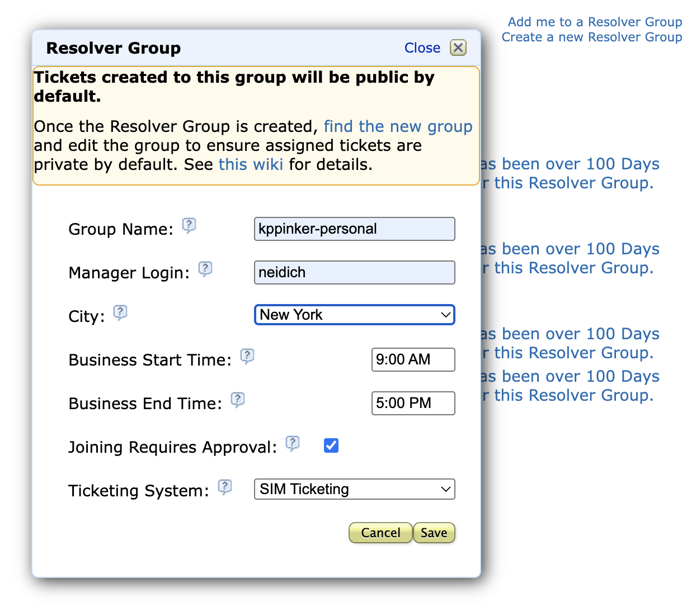
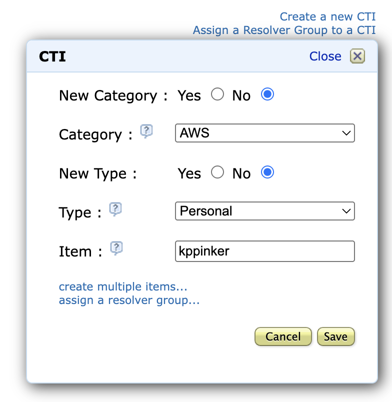
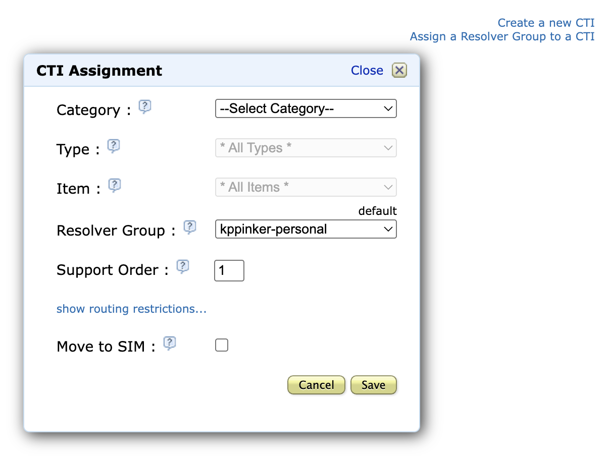
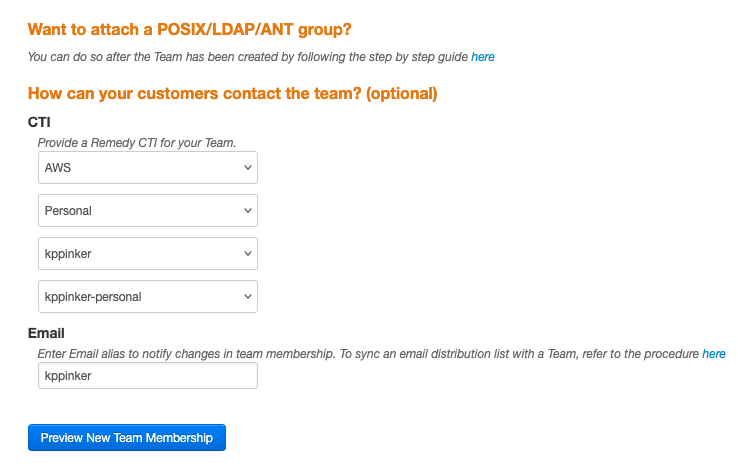

# Personal CTI/Team/Bindle Creation

These instructions will walk you through creating a personal CTI, Team, and Bindle for use with your Isengard account(s). This is a one-time process.

[TOC]

## CTI and Resolver Group

1. Navigate to [CTI Self-Service](https://cti.amazon.com/).
2. Click **Create a new Resolver Group**.
3. Enter/select the folowing parameters:

    **Group Name**: `[ALIAS]-personal`

    **Manager Login**: `[MANAGER ALIAS]`

    **City**: **[YOUR CITY]**

    

4. Click **Save**.
5. Click **Create a new CTI** towards the bottom right of page.
6. Enter/select the folowing parameters:

    **New Category**: **No**

    **Category**: **AWS**

    **New Type**: **No**

    **Type**: **Personal**

    **Item**: `[YOUR ALIAS]`

    

7. Click **Save**.
8. Click **Assign a Resolver Group to a CTI**.
9. Select the Resolver Group you created in steps 2-4.
10. Enter 1 for the **Support Order** then click **Save**.

    

## Team

It's recommended you use Firefox here as there appears to be issues with the Teams page on Chrome.

11. Navigate to [Teams](https://permissions.amazon.com/a/team/).
12. Enter a **Team Name** using the following format `[ALIAS]-team`.
    - Ex: `tamjay-team`
13. Enter a brief **Description** of your team like `Tamil's personal team`.
14. Enter your manager's alias for the **Secondary Owner**.
15. Select the **CTI** you created in the [last section](#cti-and-resolver-group).
16. Enter your **Email** alias.

    

17. Click **Preview New Membership** then check the box to **Create Team**.
18. Under **Associated POSIX/LDAP/ANT Groups**, click **Edit**.
19. Enter a **group name** using the following format `[ALIAS]-team`.
20. Select **POSIX Group** then click **Create and Add Group**.
21. Under **Membership Policy**, click the **Rule** tab then **Edit**.
22. Check the box **Reports of** then search for and select your alias.
23. Check the box **Include people listed above?** then click **Update rule**.
24. On the **Preview Difference**, click **Next**.
25. Check **confirm and acknowledge** box then click **Update rule**.

Note: Users are now required to have a non-empty posix group associated with the bindle owning team. If you are seeing an error that says "posix group doesnt exist", its likely because there are no people in posix group that you created or changes are taking some time to propogate.

## Bindle

26. Navigate to <https://bindles.amazon.com>.
27. Under **Team-owned**, click **Create new Bindle**.
    - Isengard accounts require a team-owned bindle.
28. Enter a **Bindle name** using the following format `[ALIAS]-team`.
29. Enter a **Description** using the following format `[ALIAS]-team bindle`.
30. Enter the team you created in the [last section](#create-a-team) for **Owning team**.
31. Select **Use Team CLI** then click **Submit**.

You now have a new personal Bindle you can use for Isengard!
