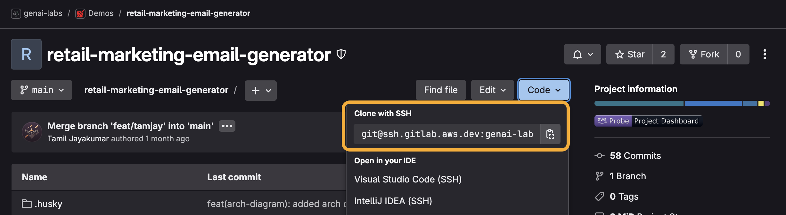
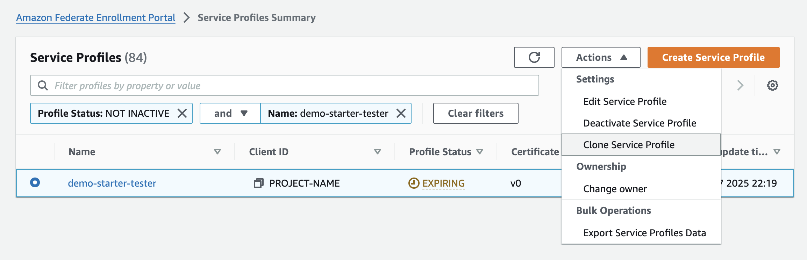
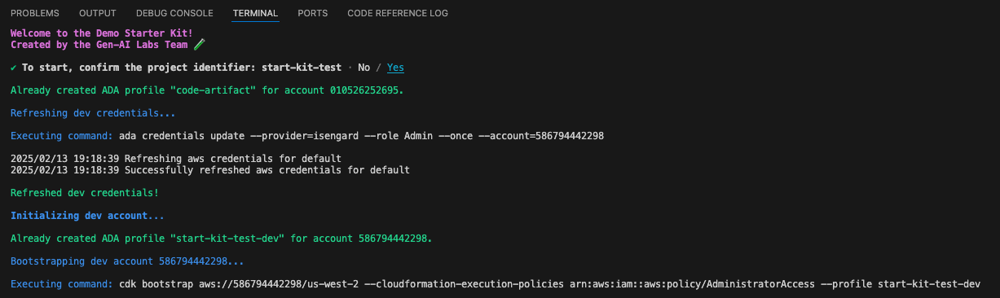
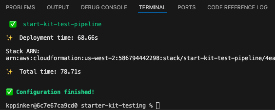
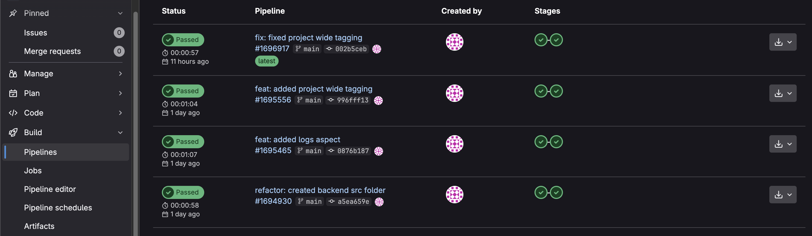
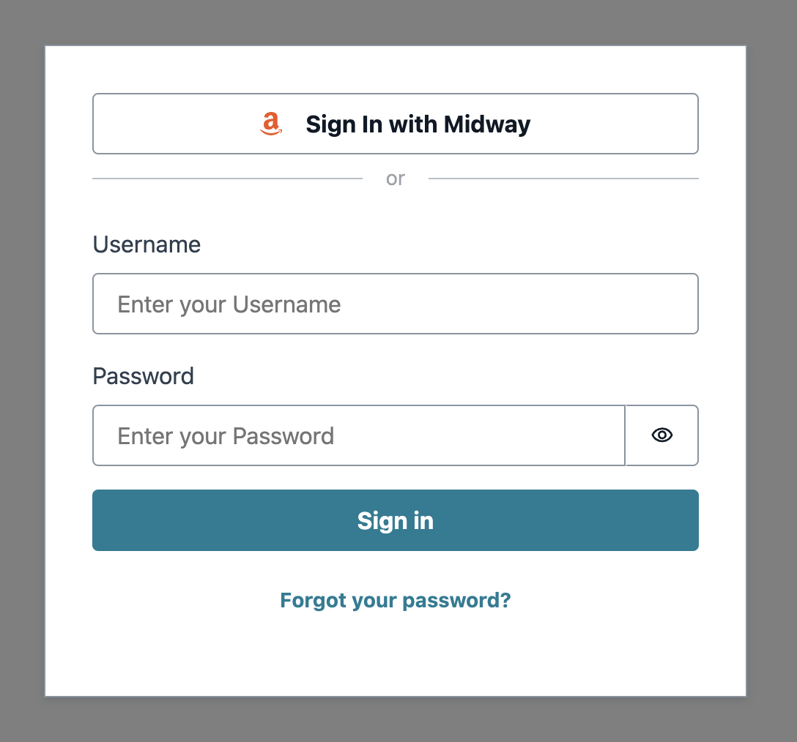

# Demo Creation

These instructions will walk you through creating a brand new demo. This is a one-time process for each demo.

[TOC]

## AWS Account(s)

You are required to have at least one dev account to use the starter kit. A single prod account and one sandbox account per builder are optional, but encouraged\*.

You can use existing Isengard accounts provided you have access to an **Admin** console role for each account.

- Follow steps 11-18 [here](./account-creation.md#dev-account) to add an admin role.

<br>\* GenAI Labs Builders are required to create new dev and prod accounts for each demo using these [instructions](./account-creation.md)<br />

## GitLab Repository

### Fork It

1. Navigate to the Demo Starter Kit [GitLab page](https://gitlab.aws.dev/genai-labs/templates/demo-starter-kit) then click **Fork**.

    

2. Enter a **Project name** using the following format `[SEGMENT]-[DEMO-NAME]` and ensure the **Project slug** updates accordingly.
    - Ex: `retail-marketing-email-generator`
3. Under **Project URL**, **select a namespace**.
    - GenAI Labs builders should select `genai-labs/demo-assets`.
    - This is a **_very important step and non-reversible_**.
4. Enter a **Project description**.
5. Under **Branches to include**, select **Only the default branch `main`**.
6. Under **Visibility level**, select the **Internal** option.

    - This is a **_very important step_** so AWS employees outside your team can view the project.

    

7. Click **Fork project**.

### Clone It

8. From your demo's new GitLab page, click the **Code** dropdown and click the copy icon to copy the SSH URL.

    

9. Open a terminal then navigate to the directory where you want to clone the files by running the command `cd [new directory]`.
10. To clone the files, run the command `git clone [copied URL]`.
    - Git automatically creates a folder with the repository name and downloads the files there.

## Configuration File

The starter kit uses a file named `project-config.json` in the config folder to centrally track and manage project configurations.

- See the [design documentation](./design.md#configuration-file) for more details.

11. Open the project folder in your IDE of choice (we prefer Visual Studio Code) then open [project-config.json](../config/project-config.json).
12. Update **projectId** with a unique identifier less than 15 characters that best reflects your project name.
    - Use a shorthand name separated by a `-`. Do not use any other special characters such as `! , & * @ # < > ?`.
    - Ex: `email-generator`
    - The CLI will throw an error if the project identifier is invalid.
13. Update **gitlabGroup** if you created your GitLab project under a different group\*.
14. Update **gitlabProject** with your GitLab project's name\*.
    - This should be the same name you provided for [step 2](#fork-it).
    - Ex: `retail-marketing-email-generator`
15. Set **codeArtifact** to `false` while we wait for [an onboarding issue](./faq.md#issue-with-codeartifact-onboarding) to be resolved\*\*.
16. Set **codePipeline** to `true` to trigger a pipeline with GitLab commits\*\*.
    - We **_strongly recommend_** setting this property to `true`, even if there is no prod account configured. If you set this property to `false`, you must manually deploy the app using the CLI.
17. Set **midway** to `true` to enable [Federate/Midway authentication](https://integ.ep.federate.a2z.com/help), allowing Amazon employees to access to your demo\*\*.
    - We **_strongly recommend_** setting this property to `true`, even if your demo may not initially need Midway authentication.
18. Update the account configuration with at least one **dev** account, including the account **number** and **region** for each account.
    - The CLI will throw an error if a dev account is not found or if the configuration is incorrect.
    - Accounts with user aliases are automatically considered sandbox accounts and can be added or removed anytime.
    - We **_strongly recommend_** using `us-west-2` for GenAI demos given service availability.
19. **Save** the project configuration file.

<br>\* This property is optional if **codePipeline** is false.<br />
\*\* This property can be toggled later, even after setting up the demo.

## GitLab CI/CD

We need to create environment variables in GitLab so the Runner can find the dev account number and region details then write to Amazon S3 and trigger its pipeline.

> [Can I just use the GitLab runner?](./faq.md#can-i-just-use-the-gitlab-runner)

20. Navigate to your GitLab repository page.
21. Click **Settings** then **CI/CD**.
22. Expand **Variables** then click **Add variable**.
23. Enter `AWS_ACCOUNT_NUMBER` for the **Key** and the dev account number used in your [project configuration file](../config/project-config.json) for the **Value** then click **Add variable**.
24. Repeat the configuration for the `AWS_ACCOUNT_REGION` and the `PROJECT_ID`.

    - You will need to check **Protect variable** after creating the first variable.

    

> [Can I use a different Git repository like GitHub?](./faq.md#can-i-use-a-different-git-repository-like-github)

## Federate/Midway Profile(s)

[Federate](https://ep.federate.a2z.com/help/FAQ#what-is-amazon-federate) has an [Integration](https://integ.ep.federate.a2z.com/profiles) and [Production](https://ep.federate.a2z.com/profiles) environment where service profiles are managed separately. If your demo has both dev and prod stages, you must create two separate profiles in those respective environments. Sandbox accounts will use the dev/Integration profile for providing access to the demo.

### Dev Profile

We have simplified Integration profile creation by creating a dummy profile for you to clone then update.

25. Navigate to <https://integ.ep.federate.a2z.com/profiles>.
26. Search for then select the profile named `demo-starter-tester`.
27. After selecting the profile, click the **Actions** dropdown then click **Clone Service Profile**.

    

28. Enter a **Service Name** using the following format `genai-labs-[PROJECT-IDENTIFIER]`.
    - The project identifier should exactly match the **projectId** in your [project configuration file](../config/project-config.json).
    - Ex: `genai-labs-email-generator`
29. Check the box titled **Unfabric guidelines**.
30. Check the box titled **Integ Environment restrictions**.
31. Leave all other options to their defaults and click **Next**.
32. Enter a **Client ID** that exactly matches the **projectId** in your [project configuration file](../config/project-config.json).
    - This is **_extremely important_** as the Client ID **_cannot be edited_** after the profile has been created.
    - Ex: `email-generator`
33. Enter **Redirect URIs** using the following format `https://[PROJECT-IDENTIFIER]-[ACCOUNT_NUMBER].auth.[ACCOUNT_REGION].amazoncognito.com/oauth2/idpresponse`.

    - The project identifier, account numbers, and regions should reflect your [project configuration file](../config/project-config.json).
    - If you are configuring sandbox account(s), then you need to add URI(s) on a new line.
    - Ex:

    ```
    https://email-generator-043309355269.auth.us-west-2.amazoncognito.com/oauth2/idpresponse
    https://email-generator-294075526655.auth.us-west-2.amazoncognito.com/oauth2/idpresponse
    https://email-generator-212075525600.auth.us-east-1.amazoncognito.com/oauth2/idpresponse
    ```

34. Turn the **Client Secret** switch on.

    

35. Click **Next**.
36. Skip over the **Discovery and Permissions Configuration** and **Claim Configuration** by clicking **Next** twice.
37. On the **Service Profile Overview** page, click **Submit**.
38. Copy the generated Midway client secret key. **_Keep it safe_**.
    > [I forgot to copy the Midway client secret key. Now what?](./faq.md#i-forgot-to-copy-the-midway-client-secret-key-now-what)
39. The Integration profile expires after 30 days. Set a recurring calendar invite to renew it.

### Prod Profile

If you created a prod account in the [project configuration file](../config/project-config.json), please continue. Otherwise you may skip to the [next section](#configuration-scripts).

40. Navigate to the [Production](https://ep.federate.a2z.com/drafts) drafts.
41. Click **Import from Integ**.
42. Enter the **client ID** you provided in [step 32](#dev-profile).
43. Verify the **Service Name** matches the one you provided in [step 28](#dev-profile).
44. Check the box titled **Unfabric guidelines** then click **Next**.
45. Verify the **Client ID** is matches the one you previously provided.
46. Update the **Redirect URI** for the prod account using the following format `https://[PROJECT-IDENTIFIER]-[PROD_ACCOUNT_NUMBER].auth.[PROD_ACCOUNT_REGION].amazoncognito.com/oauth2/idpresponse`.

    - The project identifier, account number, and region should reflect the prod account in your [project configuration file](../config/project-config.json).
    - Ex:

    ```
    https://email-generator-123409357812.auth.us-west-2.amazoncognito.com/oauth2/idpresponse
    ```

47. Turn the **Client Secret** switch on then click **Next**.
48. Skip over the **Discovery and Permissions Configuration** and **Claim Configuration** by clicking **Next** twice.
49. On the **Service Profile Overview** page, click **Submit** then copy the generated Midway client secret key. **_Keep it safe_**.
    > [I forgot to copy the Midway client secret key. Now what?](./faq.md#i-forgot-to-copy-the-midway-client-secret-key-now-what)

## Configuration Scripts

50. To install the starter kit/project dependencies, open a terminal at the root directory then run the command `npm run setup`.
    - This will install the [NPM](https://nodejs.org/en/learn/getting-started/an-introduction-to-the-npm-package-manager) dependencies and [Python dev requirements](../requirements-dev.txt). It may take a couple minutes to complete. Great time for a ☕!
51. To run the configuration CLI, run the command `npm run configure`.

    - You **_must_** run this command each time you update the [project configuration file](../config/project-config.json) file.

    

52. When prompted to **confirm the project identifier**, select **yes** to start.

53. Assuming they have not already been provided, the CLI will ask for the dev and prod Midway client secret keys from the [previous section](#create-federatemidway-profiles). Enter them.

    - The tool will automatically exit after it has finished the configuration.

    

- See the [design documentation](./design.md#clis) to learn more about the Demo Starter Kit CLIs.

### Code Defender

In order commit changes, we must first install [Code Defender](https://w.amazon.com/bin/view/AWS/Teams/GlobalServicesSecurity/Engineering/CodeDefender/UserHelp/#5).

54. Install Code Defender from [here](https://codedefender.proserve.aws.dev/).
55. From the project's root directory, run the command `git defender --setup` followed by `git-defender --mw-register`.
    - You should see a message saying **Successfully registered**.

## Code Check-In

Lets make some changes in the package before we commit our code.

56. Open the `package.json` and edit the following

    **name**: Enter the project identifier you provided in your [project configuration file](../config/project-config.json).

    **description**: Enter the description you provided in [step 4](#fork-it).

Now we are all set to make our first code check in! The starter kit comes pre-built with a commit CLI to improve the quality of Git commits.

57. From the root directory, run the command `git add -A && npm run commit`.
58. For **Select the type of change that you're committing**, select **chore**.
59. For **What is the scope of this change**, enter `app`.
60. For **Write a short, imperative tense description of the change**, enter `initial code commit`.
61. For **Provide a longer description of the change**, press **Enter** to skip.
62. For **Are there any breaking changes?** press **Enter** to indicate **N**.

63. If the commit hooks powered by Husky fail, you will need to repeat steps 2-7.
    - See the [design documentation](./design.md#commit) to learn more about the commit hooks.
64. If the commit hooks succeed, you can push the committed files to your repository with the command `git push origin main`.
    - Pushing to main will trigger a pipeline execution.

From now on, **_do not_** work and push changes on the `main` branch. Always work on a feature branch then submit a merge request via GitLab to merge changes to `main`.

65. From the root directory, run `git checkout -B feat/[ALIAS]` to create a new dev branch for yourself with your alias.
    - Ex: `git checkout -B feat/tamjay`

## Verify Pipelines

66. Navigate back to your demo's GitLab page.
67. Check the status of your GitLab pipeline by by clicking **Build** then **Pipelines** from the side menu.

    

    - There are two stages of the GitLab pipeline:
        1. SAST scanning: this stage will publish your code's SAST scan reports to the [Probe dashboard](https://probe.aws.dev/).
            - Find your project here and notice how the static code analysis has been automated using the GitLab runner.
        2. Deploy: this stage will compress the code base into a zip format, get cross-account credentials via AWS Credential Vendor, then upload the zip file to Amazon S3, kicking of the CodePipeline.

68. Once the **zip-deploy** stage succeeds, navigate to the dev account's [AWS Management Console](https://console.aws.amazon.com/codesuite/codepipeline/pipelines/) to verify that the pipeline is in-progress.
69. Once the pipeline completes, open the [CloudFormation console](https://console.aws.amazon.com/cloudformation/home?#/stacks/) then click the stack ending in **frontendDeployment**.
70. Click the **Outputs** tab then the **callbackUrl** to visit your new frontend React app.

    

🎉 Congratulations! You have successfully created your brand new demo! Now let's [set up your local development environment](./demo-development.md).
