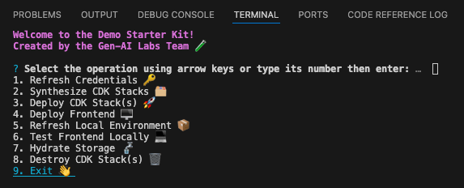
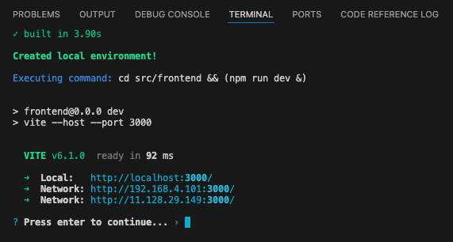

# Demo Development

These instructions will get you started developing with the starter kit, assuming your demo has already been [created](./demo-creation.md), you have already set up the project, and are ready to contribute!

[TOC]

## App

Let's start by deploying the starter kit app directly to our sandbox account for testing using the [development CLI](./design.md#development).

1. From the root directory, run the command `npm run develop`.

    

2. Select **Synthesize CDK Stacks 🗂️** to validate your CDK code.
    - Ideally, there should be no issues at this point.
3. To deploy your app, select **Deploy CDK Stack(s) 🚀** then your sandbox account.
4. Select **Yes** to deploy all stacks.

    - If you select **No**, the CLI will allow you to select exactly which stacks you would like to deploy to the target account.

    

    - Deployment may take several minutes.

5. Once the deployment completes, open the [CloudFormation console](https://console.aws.amazon.com/cloudformation/home?#/stacks/) then click the stack ending in **frontendDeployment**.
6. Click the **Outputs** tab then the **callbackUrl** to visit your new frontend React app.

    

## Frontend

Let's now setup a local server to test the frontend React app locally so you can quickly iterate.

7. Select **Test Frontend Locally 💻** then your desired stage.
8. If prompted, for **Choose the type of app that you're building**, select **javascript** then **react** then **typescript** then hit enter a few more times to accept the remaining default options.
9. Once the CLI finishes creating the local environment, click the **local** URL.

    

    - You should see the application's login page. Note that any changes made to the app will be reflected locally for you to test.

10. **Press enter to continue** to explore other operations.

- See the [design documentation](./design.md) for an in-depth look at the starter kit.
