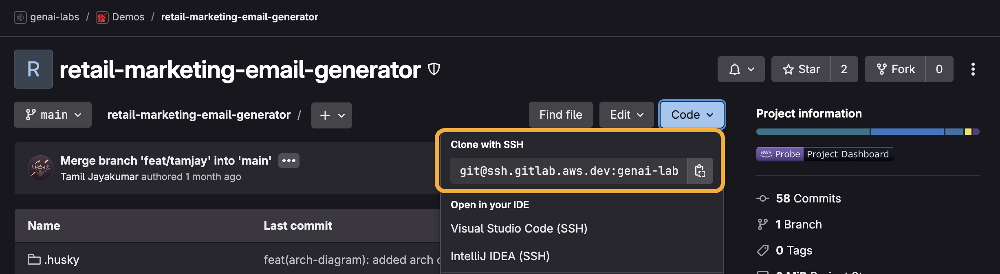
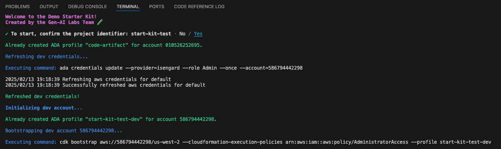

# Demo Setup

These instructions will walk you through setting up a demo, assuming your demo has already been [created](./demo-creation.md) and you are looking to set up the project.

[TOC]

## Sandbox Account

If your demo pod has more than one builder, use a personal sandbox account to develop features independently. If you do not already have a personal sandbox account or want to create a demo-specific one, follow these [instructions](./account-creation.md#sandbox-account).

## GitLab Repository

1. Navigate to your demo's [GitLab](https://gitlab.aws.dev/) page.
    - Search for the demo name under **Projects** or ask a teammate for the repository URL if necessary.
2. From the demo's GitLab page, click the **Code** dropdown and click the copy icon to copy the SSH URL.

    

3. Open a terminal then navigate to the directory where you want to clone the files by running the command `cd <new directory>`.
4. To clone the files, run the command `git clone <copied URL>`.
    - Git automatically creates a folder with the repository name and downloads the files there.

## Configuration File

The starter kit uses a file named `project-config.json` in the config folder to centrally track and manage project configurations.

- See the [design documentation](./design.md#configuration-file) for more details.

5. Open the project folder in your IDE of choice (we prefer Visual Studio Code) then open [project-config.json](../config/project-config.json).
6. If you have a personal sandbox account, but it has not been added to the project configuration file, please update it, including the account **number** and **region** for your sandbox account.
    - We **_strongly recommend_** using `us-west-2` for GenAI demos given service availability.
    - Do not worry about the **midwaySecretId** which will be set up by the configuration CLI.
7. Ensure you have not altered the configurations of your fellow builders then **save** the file.

## Federate/Midway Profile(s)

After the sandbox account has been added to the project configuration, we need to add it to the dev accounts's [Federate](https://ep.federate.a2z.com/help/FAQ#what-is-amazon-federate) profile for Midway integration automation through the configuration CLI.

8. Navigate to <https://integ.ep.federate.a2z.com/profiles>.
9. Under **Service Profiles**, search for then select the **Client ID** matching your **projectId** in the [project configuration file](../config/project-config.json).
10. Click on the profile **Name** link.
11. Click **Edit** in the top right corner then click **Ok** after reading the dialogue.
12. On the **Service Profile Configuration** page, leave all options to their defaults then click **Next** at the bottom of the page.
13. Add a **Redirect URI** on a new line using the following format `https://[PROJECT-IDENTIFIER]-[SANDBOX_ACCOUNT_NUMBER].auth.[SANDBOX_ACCOUNT_REGION].amazoncognito.com/oauth2/idpresponse`.

    - The project identifier, account number, and region should reflect the sandbox account you added to the [project configuration file](../config/project-config.json).
    - Ex:

    ```
    https://email-generator-043309355269.auth.us-west-2.amazoncognito.com/oauth2/idpresponse
    https://email-generator-294075526655.auth.us-west-2.amazoncognito.com/oauth2/idpresponse
    https://email-generator-212075525600.auth.us-east-1.amazoncognito.com/oauth2/idpresponse
    ```

    - Please **_be careful not to edit exisiting URIs_** as this will cause Midway login to malfunction for associated accounts.

14. Click **Next**.
15. Skip over the **Discovery and Permissions Configuration** and **Claim Configuration** by clicking **Next** twice.
16. On the **Service Profile Overview** page, click **Submit**.

## Configuration Scripts

17. To install the project depedencies, open a terminal at the root directory then run the command `npm run setup`.
    - This will install the [NPM](https://nodejs.org/en/learn/getting-started/an-introduction-to-the-npm-package-manager) dependencies and [Python dev requirements](../requirements-dev.txt). It may take a couple minutes to complete. Great time for a ☕!
18. To run the configuration CLI, run the command `npm run configure`.

    - You **_must_** run this command each time you update the [project configuration file](../config/project-config.json) file.

    

19. When prompted to **confirm the project identifier**, select **yes** to start.

    - The tool will automatically exit after it has finished the configuration.

    

- See the [design documentation](./design.md#clis) to learn more about the Demo Starter Kit CLIs.

### Code Defender

In order commit changes, we must first install [Code Defender](https://w.amazon.com/bin/view/AWS/Teams/GlobalServicesSecurity/Engineering/CodeDefender/UserHelp/#5).

20. Install Code Defender from [here](https://codedefender.proserve.aws.dev/).
21. From the project's root directory, run the command `git defender --setup` followed by `git-defender --mw-register`.
    - You should see a message saying **Successfully registered**.

## Code Check-In

**_Do not_** work and push changes on the `main` branch. Always work on a feature branch then submit a merge request via GitLab to merge changes to `main`, which will trigger the pipeline.

22. From the root directory, run `git checkout -B feat/[ALIAS]` to create a new dev branch for yourself with your alias.
    - Ex: `git checkout -B feat/tamjay`

Now we are all set to make our first code check in! The starter kit comes pre-built with a commit CLI to improve the quality of Git commits.

23. From the root directory, run the command `npm run commit`.
24. For **Select the type of change that you're committing**, select **chore**.
25. For **What is the scope of this change**, enter `app`.
26. For **Write a short, imperative tense description of the change**, enter `initial code commit`.
27. For **Provide a longer description of the change**, press **Enter** to skip.
28. For **Are there any breaking changes?** press **Enter** to indicate **N**.

29. If the commit hooks powered by Husky fail, you will need to repeat steps 2-7.
    - See the [design documentation](./design.md#commit) to learn more about the commit hooks.
30. If the commit hooks succeed, you can push the committed files to your repository with the command `git push`.

🎉 Congratulations! You have successfully set up your brand new demo! Now let's [set up your local development environment](./demo-development.md).
