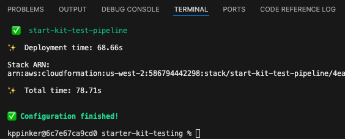
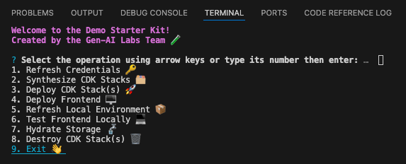
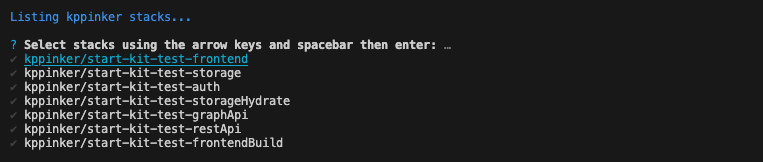
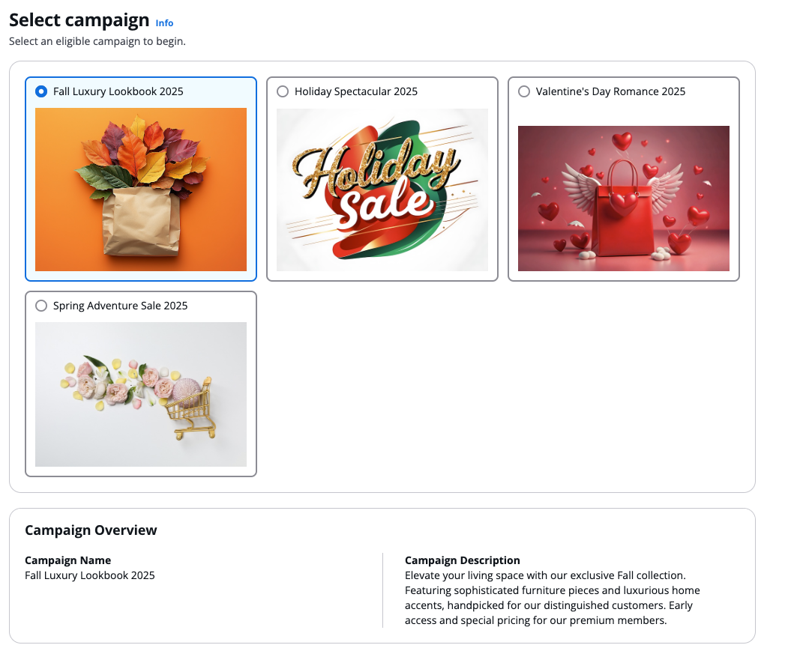
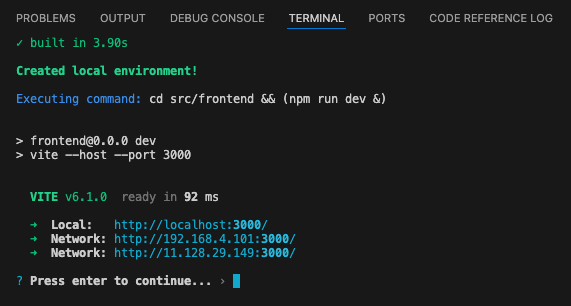
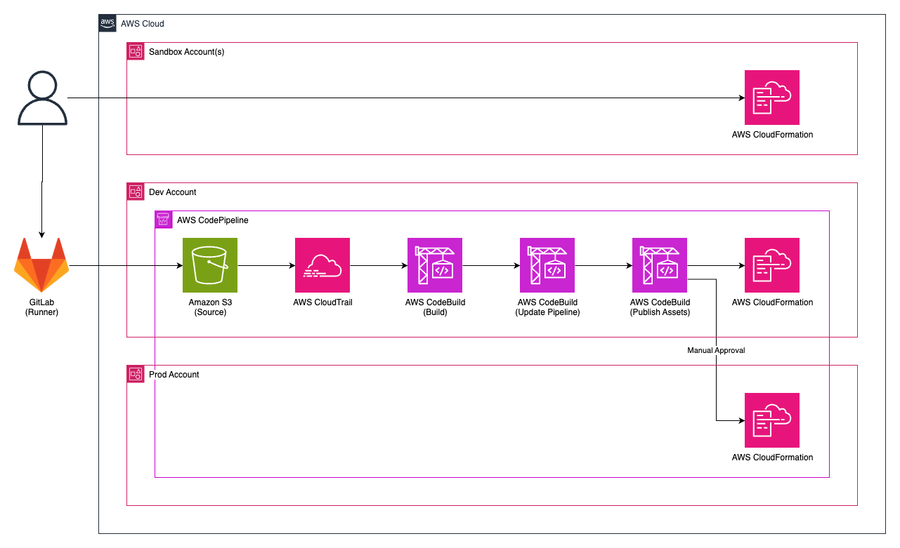

# Design

This documentation will walk you through how the Demo Starter Kit works in depth so you can better leverage and/or customize its functionality.

[TOC]

## Configuration File

The starter kit uses a file named [project-config.json](../config/project-config.json) in the config folder to centrally track and manage project configurations.

```json
{
    "projectId": "PROJECT-IDENTIFIER",
    "gitlabGroup": "genai-labs/demo-assets",
    "gitlabProject": "GITLAB-PROJECT-NAME",
    "codeArtifact": false,
    "codePipeline": true,
    "midway": true,
    "accounts": {
        "dev": {
            "number": "AWS_ACCOUNT_ID",
            "region": "AWS_REGION"
        },
        "prod": {
            "number": "AWS_ACCOUNT_ID",
            "region": "AWS_REGION"
        },
        "ALIAS_1": {
            "number": "AWS_ACCOUNT_ID",
            "region": "AWS_REGION"
        },
        "ALIAS_2": {
            "number": "AWS_ACCOUNT_ID",
            "region": "AWS_REGION"
        }
        // more aliases if needed
    }
}
```

[index.ts](../config/index.ts) will throw an error if a dev account is not found or if the configuration is incorrect to prevent downstream errors in the CLIs or CDK constructs.

### Project Identifier

The **projectId** property must be less than 15 characters long and not use any special characters other than `-`. It serves as a unique project identifier for:

- Creating a prefix for stack names and generated resource names, supporting multiple demo deployments in the same account.
- Tagging all CDK resources in the project.
    - See the [stack construct](../src/backend/lib/common/constructs/stack.ts) for more context.
- Linking Midway profiles to the Amazon Cognito domain URL.
    - See the [Cognito construct](#cognito-construct) for more context.

### GitLab Group / Project

If **codePipeline** is `false`, the **gitlabGroup** and **gitlabProject** properties are optional. These properties are used to give the GitLab runner the necessary permissions to write to Amazon S3, which triggers the pipeline. See the [pipeline stack](#pipeline-stack) for more details.

### CodeArtifact

Setting **codeArtifact** to `true` enables the use of [CodeArtifact](https://docs.hub.amazon.dev/codeartifact/user-guide/getting-started/) in the [CodeBuild construct](#codebuild-construct).

### CodePipeline

When **codePipeline** is set to `true`, the configuration CLI will deploy a [self-mutating pipeline](https://docs.aws.amazon.com/cdk/v2/guide/cdk_pipeline.html) to the account labeled "dev" in the project configuration file. See the [pipeline stack](#pipeline-stack) and [configuration CLI](#configuration) for more details.

### Midway

Seting **midway** to `true` enables [Federate/Midway authentication](https://integ.ep.federate.a2z.com/help), allowing Amazon employees to access to your demo. You can also use Federate to limit access to your demo to particular teams and/or users.

## CLIs

The starter kit comes packages with three scripts/CLIs: **configure**, **develop**, and **commit**. The former two were developed by the GenAI Labs team and can be found in `tools/cli`.

Here are some basic guidelines for the CLIs:

- Commands must be run from the project's root directory.
- Commands are run as standard "npm" scripts so we must append `npm run [command]`
- Run the command `npm run setup` from the root directory before running any other commands.
- Press the escape button to cancel an operation or go back to the main menu from any sub menu.
- To exit the CLI press control + "C" or select **Exit**.
- Feel free to change/alter tool behavior for project specific needs.

### Configuration

```bash
npm run configure
```

The configuration CLI will perform the following operations:

1.  Create ADA profiles for each of the accounts in the project configuration.
2.  Bootstrap those accounts in the region configured and `us-east-1`, including trust relationships with dev and termination protection for prod accounts.
3.  Map Midway secrets to those accounts, if the **midway** property is set to `true`.
    - If not already provided, the CLI will ask for the dev and prod Federate/Midway client secret keys from the [Federate profile](./demo-creation.md#federatemidway-profiles).
    - The secret keys you provide are used in the creation of Midway secrets in AWS Secrets Manager, which are tracked via the **midwaySecretId** in the project configuration file.
4.  Deploy the dev pipeline, if the **codePipeline** property is set to `true`.

The configuration CLI will automatically exit after it has finished the configuration.



You **_must_** run this command each time you update the project configuration file.

See [configure.ts](../tools/cli/configure.ts) for more context.

### Development

```bash
npm run commit
```

The development CLI provides a set of options to help facilitate local development.



See [develop.ts](../tools/cli/develop.ts) for more context.

#### Refresh Credentials

- This operation will use [ADA](https://w.amazon.com/bin/view/DevAccount/Docs/) to fetch AWS credentials for the target account configured in the project configuration file.
    - The received credentials are always stored under the `default` profile in the [AWS config files](https://docs.aws.amazon.com/cli/v1/userguide/cli-configure-files.html).
- The CLI runs this operation before each action to keep things simple.

#### Synthesize CDK Stacks

- This operation will validate your CDK code and check for [CDK NAG](https://github.com/cdklabs/cdk-nag) errors/warnings.
- The CLI will transparently output the stack building process, Docker invocations, etc. to keep you informed.

#### Deploy CDK Stack(s)

- If you elect to not just deploy all stacks, the operation will allow you to select exactly which stacks you would like to deploy to the target account.

    - It will first use `cdk list` to list all available stacks for that target account.
        - Note that stacks in the dev account will be prefixed with the pipeline stack name.
            - Ex: `start-kit-test-pipeline/dev/start-kit-test-frontend`
            - See [pipeline stack](#pipeline-stack) for more details.

    

    - Using the arrow keys and spacebar, you select each and every stack you want to deploy then hit enter to confirm.

- Stack dependencies will also be deployed alongside the selected stacks to ensure functionality.
- The operation uses the `--concurrency` flag to deploy stacks in parallel for faster deployment.

#### Hotswap CDK Stack(s)

- This operation is similar to the [previous operation](#deploy-cdk-stacks), but it performs a faster, hotswap deployment if possible. See the [documentation](https://docs.aws.amazon.com/cdk/v2/guide/ref-cli-cmd-deploy.html#ref-cli-cmd-deploy-options) for more details.

Many demos use synethetic data, such as as flat files (text/JSON/XML), images, and videos that need to be used in your application.



- This operation can be used to speed up asset changes of Amazon S3 bucket deployments like that in the [storage construct](../src/backend/lib/stacks/backend/storage/index.ts).
    - When you push data to the S3 bucket, folders in `src/backend/lib/stacks/backend/storage/assets` become prefixes that can be referenced after authenticating with Cognito.

##### Static Files vs Hydration

Sometimes, we just need static file serving through which files (images, icons, simple HTML/JS scripts, etc.) can be accessed globally with just a simple URL. There is an `assets` folder under `src/frontend/src` for this purpose.

- Ex: `https://d1ohf10999rv0h.cloudfront.net/assets/arch-DS8hMkeH.png`
    - Note the `assets` prefix. If you have nested folders, then they must be included in the URL path as well.
        - Ex: `cloudfront.net/assets/folder/filename.png`.

Keep in mind that `static` files/folders can simply be accessed without any authorization tokens by directly referencing their URL path. Only use small files that can be accessed without any protections such as icons, fonts, brand logos, etc.

#### Deploy Frontend

- This operation deploys the [frontend deployment stack](../src/backend/lib/stacks/frontend/index.ts) by itself using the `-e` flag for quicker deployment.
- It first builds the frontend to ensure there are no errors.

#### Refresh Local Environment

- This operation is invoked by the [next operation](#test-frontend-locally-) automatically, but it can also be run by itself if you just want to:
    - Pull down the CfnOutputs from the [frontend deployment stack](../src/backend/lib/stacks/frontend/index.ts).
    - Update the .env file in the frontend source folder with those outputs.
    - If a Graph API ID is present, generate GraphQL files.

#### Test Frontend Locally

- This operation will [refresh the local environment](#refresh-local-environment-) then output a link to a [local server](http://localhost:3000/) for testing changes to your frontend React app.

    

    - Assuming there are no breaking changes, you should be able to see your changes reflected in the terminal and browser immediately.

- After you **press enter to continue**, the operation will kill the local server so future changes don't clutter the terminal.

#### Destroy CDK Stack(s)

- This operation will first use `cdk list` to list all available stacks for that target account.
    - Note that stacks in the dev account will be prefixed with the pipeline stack name.
        - Ex: `start-kit-test-pipeline/dev/start-kit-test-frontend`
        - See [pipeline stack](#pipeline-stack) for more details.


- Using the arrow keys and spacebar, you select each and every stack you want to destroy then hit enter to confirm.

- Use this operation with **_extreme caution_** as the CDK stacks destroyed with this operation cannot be recovered and may leave your application broken when using dependent stacks.
- There are certain limitations with this operation due to how CDK is designed:
    - Stacks that are destroyed are still listed because the CDK uses the local `cdk.out` manifest, unlike [Terraform](https://www.hashicorp.com/products/terraform) and [Pulumi](https://github.com/pulumi/pulumi) which retain a cloud referenced stack list.
    - We recommend that you delete the stacks in accordance with their dependencies in [stage.ts](../src/backend/lib/stage.ts).
    - This operation may not destroy certain cloud resource such as AWS WAF (Global & Regional), AWS Buckets, VPC configurations, Secrets Manager, etc. Manually delete these resources in the AWS Management Console.

#### Headless Mode

The development CLI can be also used in headless mode by directly providing the operation and stage as command line arguments.

- Ex: `npm run develop deploy-frontend dev`

You can expand on this feature to build your own functionality and extend the abilities of CLI to suit your demo specific requirements.

### Commit

```bash
npm run commit
```

The commit CLI is provided by [Commitizen](https://commitizen-tools.github.io/commitizen/). See their [documentation](https://commitizen-tools.github.io/commitizen/tutorials/writing_commits/) for more details.

#### Hooks

The starter kit also includes two commit hooks, powered by [Husky](https://typicode.github.io/husky/), that will run automatically after the commit CLI:

- The pre-commit hook will run code formatting and quality checks, stopping you from committing bad code that might block the pipeline.
    - [lint-staged](https://github.com/lint-staged/lint-staged) will format and lint staged files.
        - Formatting and linting will be handled by [Prettier](https://prettier.io/) and [ESLint](https://eslint.org/) for TypeScript and [Ruff](https://docs.astral.sh/ruff/) for Python.
    - See [pre-commit](../.husky/pre-commit), [package.json](../package.json), [eslint.config.ts](../eslint.config.ts), and [.prettierrc](../.prettierrc) for more context.
- The commit-msg hook will validate the commit message and ensure it follows the [Git Conventional Commits Standard](https://www.conventionalcommits.org/en/v1.0.0/).
    - See [commit-msg](../.husky/commit-msg) for more context.

## CDK Constructs

Some aspects of the starter kit infrastructure are specific to internal Amazon authentication/security requirements. Remove the [pipeline](#pipeline-stack) stack as well as the [Cognito](#cognito-construct) and [CodeBuild](#codebuild-construct) constructs before sharing publicly.

### App

`bin/demo.ts` is the CDK entrypoint as configured in [cdk.json](../cdk.json).

The stack prefix and stage for the app are determined by a context variable passed by the [development CLI](#development). The account details are determined by the project configuration file itself.

See [bin/demo.ts](../src/backend/bin/demo.ts) for more context.

### Pipeline Stack



This stack is only deployed to the `dev` account via the [configuration CLI](#configuration) when the **codePipeline** property is set to `true` in the project configuration file.

It sets up all the necessary resources and permissions for the GitLab runner to upload zipped code from commits to Amazon S3, kicking off the CodePipeline.

- An Amazon S3 source bucket to which the GitLab runner will upload the zipped code.
- An Amazon CloudTrail trial that tracks write events in the source bucket to trigger the pipleine.
- An AWS IAM role that will be assumed by the [GitCI Credential vendor](https://gitlab.pages.aws.dev/docs/Platform/aws-credential-vendor.html), allowing it access to the source bucket.
- An AWS pipeline construct for synthesizing the infrastructure then deploying it to each stage.
    - A dev stage that deploys the [application stage](../src/backend/lib/stage.ts) to the dev account in the [project configuration file](../config/project-config.json).
    - If configured, a prod stage that deploys the application stage to the prod account in the project configuration file.

See [pipeline.ts](../src/backend/lib/stacks/pipeline.ts) and [.gitlab-ci.yml](../.gitlab-ci.yml) for more context.

> [Can I just use the GitLab runner?](./faq.md#can-i-just-use-the-gitlab-runner)

### Cognito Construct

This custom construct sets the necessary properties for creating a Federate/Midway-compatible User Pool and User Pool Client.

- It uses **midwaySecretId** to import a Midway secret from AWS Secrets Manager. The stage, whether prod or not, determines which secret is used.
- It uses the project identifier as the **clientId** and in the User Pool Domain URL to align with the [redirect URIs we set up in Federate](./demo-creation.md#federatemidway-profiles).
- It also adds a **callbackUrls** property for referencing the CloudFront distribution URL and `http://localhost:3000` for enabling Midway for local development.

You can simply replace the standard `UserPool` construct with `LabsUserPool` and the standard `UserPoolClient` construct with `LabsUserPoolClient` to add Midway authorization.

See [cognito.ts](../src/backend/lib/common/constructs/cognito.ts) for more context.

### CodeBuild Construct

This custom construct enables the use of [CodeArtifact (formerly Goshawk)](https://docs.hub.amazon.dev/codeartifact/user-guide/getting-started/) in both the [frontend deployment stack](../src/backend/lib/stacks/frontend/index.ts) and [pipeline stack](../src/backend/lib/stacks/pipeline.ts).

See [codebuild.ts](../src/backend/lib/common/constructs/codebuild.ts) for more context.
